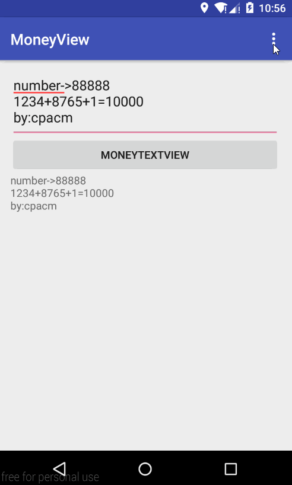

# MoneyTextView

---

**An extended TextView to be used for displaying Money Values.**

<center></center>

## How to use

#### JCentral

This project has been pushed to JCentral, in `aar`.

`aar`文件已经上传到JCenter中，可以通过gradle直接使用。


gradle:

```
compile 'net.cpacm.moneytext:moneyview:1.0.0'
```


##### Config in xml

```xml
    <net.cpacm.moneyview.MoneyTextView
        android:id="@+id/money_tv"
        android:layout_width="match_parent"
        android:layout_height="match_parent"
        app:moneyColor="@color/red"
        app:moneyFormat="format_integer"
        app:decimalRate="0.6"
        app:moneyFont="[asserts]font.otf"
        app:moneyMode="digit"
        app:symbol="$"
        app:symbolRate="0.8"
        app:moneyRate="1.2"
        app:moneyText="cpacm"/>
```

### Or config in java code

```java
moneyTv.setMoneyColor(getResources().getColor(R.color.red));
moneyTv.setMoneyFormat(MoneyTextView.MoneyFormat.FORMAT_INTEGER);
moneyTv.setDecimalRate(0.6f);
moneyTv.setMoneyFont("fonts/AkzidenzGrotConBQ-Regular.otf");//font file should be put in asserts folder
moneyTv.setMoneyMode(MoneyTextView.MoneyMode.DIGIT);
moneyTv.setSymbol("$");
moneyTv.setSymbolRate(0.8f);
moneyTv.setMoneyRate(1.2f);
moneyTv.setMoneyText("cpacm");
```


